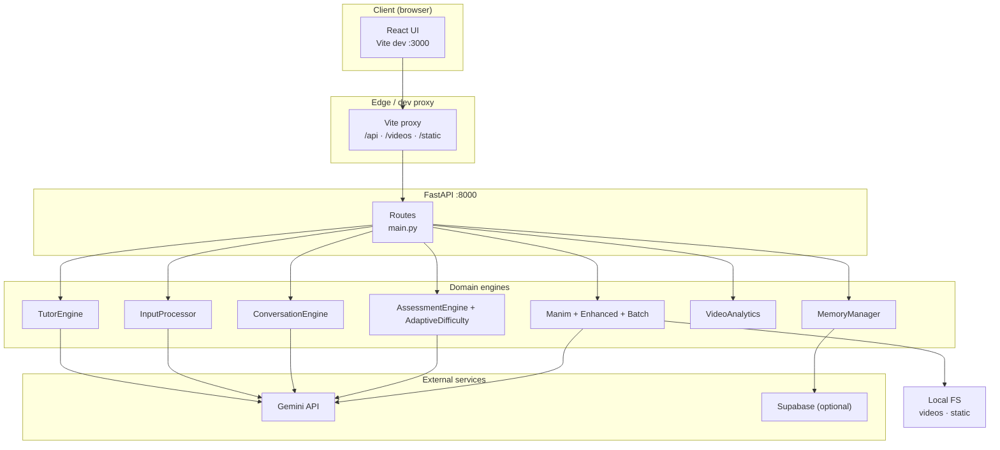
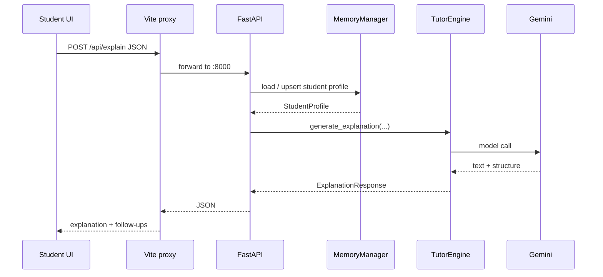
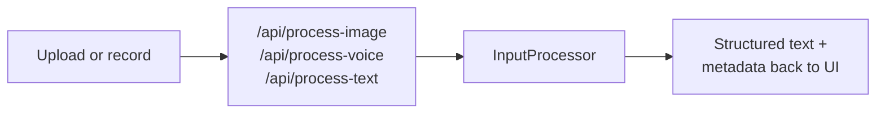

<div align="center">

# SnapLearn AI

**Adaptive tutoring engine** with multimodal input, conversational learning, Manim-backed video, and a REST API you can embed in your own products.

[](https://www.python.org/)
[](https://fastapi.tiangolo.com/)
[](https://react.dev/)
[](https://www.typescriptlang.org/)
[](https://ai.google.dev/)

[Quick start](#quick-start) · [Run and test](#how-to-run-and-test-this-project) · [Commands](#command-reference) · [Architecture](#architecture--workflow)

</div>

---

## What this project is

SnapLearn AI is a **full-stack learning demo** that combines:

| Layer | Role |
|-------|------|
| **Frontend** | React (Vite) UI: tutor, video studio, profile, SDK demo. Proxies `/api`, `/videos`, and `/static` to the backend in dev. |
| **Backend** | FastAPI app exposing tutoring, multimodal processing, conversation and assessment flows, adaptive signals, and enhanced video endpoints. |
| **AI** | Google Gemini (`google-genai`) for explanations, vision OCR, and script-style generation where implemented. |
| **Media** | Manim (where installed) for rendered lesson videos; local folders for output and static assets. |
| **Memory** | Student profiles and history via Supabase when configured, otherwise **local JSON** under `data/`. |

It is built for **hackathon-style iteration**: dynamic behavior where possible, with small mocks only where needed for a stable demo (see [CHANGELOG](Reference%20Docs/CHANGELOG.md) for phase detail).

---

## Features (by phase)

| Phase | Highlights |
|-------|------------|
| **1** | Core `/api/explain`, video generation, student profile API, animated blackboard UI. |
| **2** | Image and voice pipelines, text normalization, math hints, tabbed tutor input. |
| **3** | Conversation engine, assessments, adaptive difficulty, confusion signals, parent dashboard data, study recommendations. |
| **4** | Contextual and styled video generation, batch jobs, video sessions, analytics, recommendations, thumbnails. |
| **5** | SDK demo portal module, advanced assessment system, multi-tenant and integration hub **Python modules**, JS/Python SDK samples, Docker and deploy scripts. *Default dev server remains `backend/main.py`; see [Optional Phase 5 API stack](#optional-phase-5-api-stack) for `main_phase5.py`.* |

---

## Repository layout

```text
SnapLearn/
├── backend/
│   ├── main.py                 # Default FastAPI entry (dev)
│   ├── main_phase5.py        # Extended Phase 5 API sketch (separate entrypoint)
│   ├── models.py             # Pydantic models
│   ├── tutor_engine.py       # Explanations and tutoring
│   ├── manim_generator.py    # Classic Manim pipeline
│   ├── enhanced_manim_generator.py
│   ├── batch_video_generator.py
│   ├── video_analytics.py
│   ├── input_processor.py    # Image / voice / text
│   ├── conversation_engine.py
│   ├── assessment_engine.py
│   ├── adaptive_difficulty.py
│   ├── memory.py             # Profiles + Supabase or JSON fallback
│   ├── utils.py
│   ├── sdk_demo_portal.py
│   ├── advanced_assessment_system.py
│   ├── multi_tenant_system.py
│   ├── integration_hub.py
│   ├── requirements.txt
│   ├── requirements-prod.txt
│   ├── Dockerfile.prod
│   └── .env.example
├── frontend/
│   ├── src/
│   │   ├── App.tsx           # Routes: /, /videos, /profile, /sdk-demo
│   │   ├── pages/            # TutorPage, VideoPage, ProfilePage, SDKDemoPage
│   │   ├── components/       # Blackboard, multimodal, Advanced/Enhanced tutor & video UIs
│   │   ├── utils/api.ts      # Typed API client
│   │   └── types/index.ts
│   ├── vite.config.ts        # Dev server + proxy to :8000
│   └── package.json
├── sdk/
│   ├── javascript/snaplearn-ai-sdk.js
│   └── python/snaplearn_ai_sdk.py
├── deploy/
│   ├── production-deploy.sh
│   └── test-phase5-demo.sh
├── docker-compose.prod.yml
├── .env.prod.template
├── data/                     # Local persistence (gitignored patterns may apply)
├── videos/                   # Generated media (often gitignored)
├── static/
└── Reference Docs/
    └── CHANGELOG.md          # Phase tables, testing notes, deep changelog
```

---

## Architecture and workflow

The diagrams below treat the system as **layered signal flow**: requests move through the edge (browser), the API surface, specialized engines, and persistence. That matches an *algorithmic documentation* view (structured flow, emergent behavior at each tier) without shipping a separate generative art binary in the repo.

### System context



### Typical tutoring request (high level)



### Multimodal path (conceptual)



---

## Prerequisites

- **Python** 3.11+ recommended (3.8+ may work; align with `requirements.txt`).
- **Node.js** 18+ and npm.
- **Gemini API key**: [Google AI Studio](https://aistudio.google.com/app/apikey).
- **Manim** (optional): required only if you want local video renders to succeed end-to-end; otherwise video endpoints may return structured placeholders or errors depending on environment.

---

## Quick start

### 1) Backend

**Windows (PowerShell)**

```powershell
cd backend
python -m venv .venv
.\.venv\Scripts\Activate.ps1
pip install -r requirements.txt
Copy-Item .env.example .env
# Edit .env: set GOOGLE_API_KEY=...
python main.py
```

**macOS / Linux**

```bash
cd backend
python3 -m venv .venv
source .venv/bin/activate
pip install -r requirements.txt
cp .env.example .env
# Edit .env: set GOOGLE_API_KEY=...
python main.py
```

Server: **http://localhost:8000** (reload enabled when started via `main.py`).

Equivalent explicit Uvicorn:

```bash
cd backend
uvicorn main:app --host 0.0.0.0 --port 8000 --reload
```

### 2) Frontend

```bash
cd frontend
npm install
npm run dev
```

App: **http://localhost:3000** (Vite opens browser if configured).

### 3) Verify connectivity

```bash
curl -s http://localhost:8000/health
```

The React shell calls the same health endpoint on load; if the backend is down you will see the in-app connection error screen with copy-paste commands.

---

## How to run and test this project

Do these in order the first time you clone the repo.

| Step | Action | Expected |
|------|--------|----------|
| 1 | Start backend (`python main.py` from `backend/`) | Terminal shows Uvicorn on port **8000**. |
| 2 | `curl http://localhost:8000/health` | JSON `healthy` and per-service flags. |
| 3 | Start frontend (`npm run dev` from `frontend/`) | Vite on **3000**, app loads without connection error. |
| 4 | Open **http://localhost:3000** | Tutor page: ask a question (e.g. fractions or photosynthesis). |
| 5 | Use **tabs** on the tutor UI | Exercise **text**, **image**, and **voice** flows where your OS permissions allow. |
| 6 | Toggle **Advanced mode** and **Video mode** (header) | Phase 3 and Phase 4 surfaces (see UI labels). |
| 7 | Open **http://localhost:3000/videos** | Request a video; confirm API calls in Network tab (`/api/...`). |
| 8 | Open **http://localhost:3000/profile** | Inspect or adjust student id tied to `MemoryManager`. |
| 9 | Open **http://localhost:3000/sdk-demo** | SDK-oriented demo page bundled in the SPA. |
| 10 | Open **http://localhost:8000/docs** | Interactive Swagger for every route on `main.py`. |

**Sample API call (no browser)**

macOS / Linux (`curl`):

```bash
curl -s -X POST http://localhost:8000/api/explain \
  -H "Content-Type: application/json" \
  -d '{"question":"What is photosynthesis?","student_id":"demo-student","grade_level":"5","language":"en"}'
```

Windows PowerShell (`Invoke-RestMethod`):

```powershell
Invoke-RestMethod -Uri "http://localhost:8000/api/explain" -Method Post `
  -ContentType "application/json" `
  -Body '{"question":"What is photosynthesis?","student_id":"demo-student","grade_level":"5","language":"en"}'
```

Windows CMD (`curl.exe`):

```bat
curl.exe -s -X POST http://localhost:8000/api/explain -H "Content-Type: application/json" -d "{\"question\":\"What is photosynthesis?\",\"student_id\":\"demo-student\",\"grade_level\":\"5\",\"language\":\"en\"}"
```

**Deeper test matrices**

Phase-by-phase checklists, curl examples, and edge cases live in:

- [Reference Docs / CHANGELOG.md](Reference%20Docs/CHANGELOG.md)

---

## Command reference

### Backend

| Command | Purpose |
|---------|---------|
| `pip install -r requirements.txt` | Install runtime and dev Python deps. |
| `python main.py` | Start API with reload (uses `validate_environment()`). |
| `uvicorn main:app --reload --port 8000` | Same app module, explicit Uvicorn. |
| `pytest` | Run tests if you add or extend suites under `backend/`. |
| `black .` | Format (dev dependency). |
| `flake8 .` | Lint (dev dependency). |

### Frontend

| Command | Purpose |
|---------|---------|
| `npm install` | Install dependencies. |
| `npm run dev` | Dev server with API proxy. |
| `npm run build` | Production bundle to `dist/`. |
| `npm run preview` | Serve built output locally. |
| `npm run type-check` | `tsc --noEmit`. |
| `npm run lint` | ESLint on `src/`. |

### Optional Phase 5 API stack

`backend/main_phase5.py` is an **alternate** FastAPI application that wires demo portal, advanced assessment, multi-tenant, and integration modules. It expects auth dependencies and extra services (for example Redis) that you may not have in a minimal dev box.

```bash
cd backend
# After installing any extra deps those modules import (see their imports)
uvicorn main_phase5:app --host 0.0.0.0 --port 8001 --reload
```

Use a second port so it does not collide with `main.py` on **8000**.

### Optional Docker (production-style)

From repo root (Docker Desktop or Engine required):

```bash
docker compose -f docker-compose.prod.yml --env-file .env.prod config
```

Copy `.env.prod.template` to `.env.prod`, fill secrets, then follow comments inside `docker-compose.prod.yml` and `deploy/production-deploy.sh` (bash). On Windows, run the compose file from WSL or Git Bash if you do not have Compose v2 in PowerShell.

---

## Configuration

| Variable | Where | Notes |
|----------|-------|-------|
| `GOOGLE_API_KEY` | `backend/.env` | Required for Gemini calls. |
| `SUPABASE_URL`, `SUPABASE_ANON_KEY` | `backend/.env` | Optional; omit for local JSON mode. |
| `HOST`, `PORT`, `RELOAD` | `backend/.env` | Defaults suit local dev. |

Full template: `backend/.env.example`.

---

## API surface (default `main.py`)

High-signal groups (see `/docs` for the full list):

- **Core**: `/api/explain`, `/api/generate-video`, `/api/assess`
- **Student**: `/api/student/{id}/profile`, `/api/student/{id}/videos`
- **Multimodal**: `/api/process-image`, `/api/process-voice`, `/api/process-text`
- **Conversation**: `/api/conversation/start`, `/api/conversation/continue`
- **Adaptive**: `/api/assessment/comprehensive`, `/api/difficulty/adapt`, `/api/learning-path/optimize`, `/api/confusion/detect`, `/api/recommendations/study`, `/api/analytics/learning/{student_id}`, `/api/dashboard/parent/{student_id}`
- **Video+**: `/api/video/*` (contextual, batch, session, analytics, feedback, recommendations, thumbnails)
- **Debug**: `/api/debug/memory`, `/api/debug/reset/{student_id}`
- **Static**: `/sdk-demo` (HTML helper), mounted `/static`, `/videos`

---

## Contributing

1. Fork the repository.
2. Branch from `main` (or your default branch).
3. Keep changes scoped; match existing style.
4. Run `npm run type-check` and backend checks you rely on before opening a PR.

---

## License

MIT. See `LICENSE` if present in the repository.

---

## Links

- **Issues**: [github.com/DarshanKrishna-DK/SnapLearn/issues](https://github.com/DarshanKrishna-DK/SnapLearn/issues)
- **Changelog and testing**: [Reference Docs / CHANGELOG.md](Reference%20Docs/CHANGELOG.md)

---

<div align="center">

**Stack**: FastAPI · Uvicorn · React · Vite · TypeScript · Tailwind CSS · Google Gemini · Manim (optional) · Supabase (optional)

</div>
